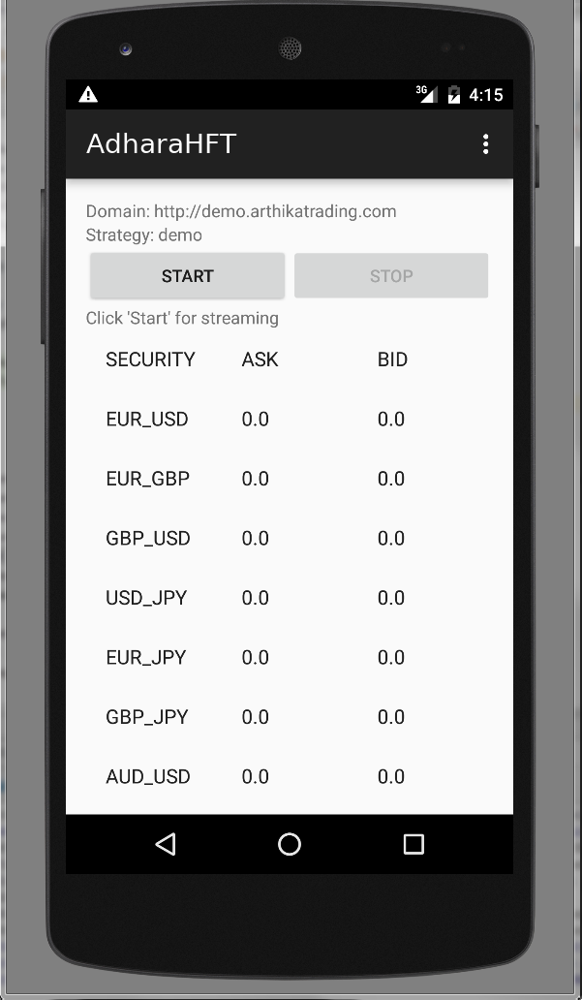
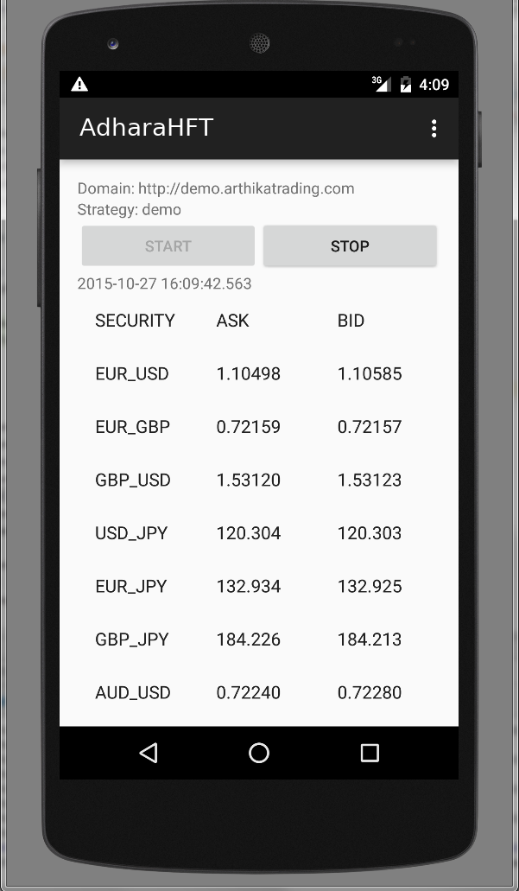
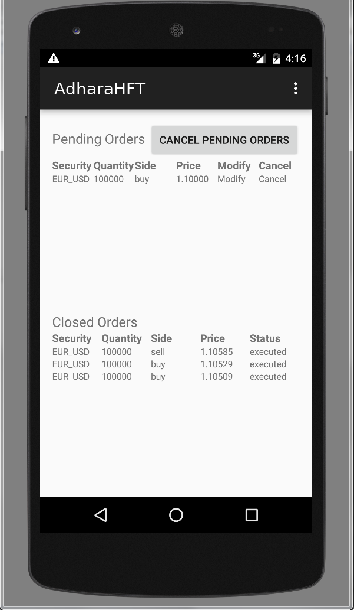

# REST API Android demonstrator
This sample App for Android demonstrates the use of Adhara's REST API.
##### Table of Contents 

[Screenshots](#Screenshots)   
[Requirements](#Requirements)   
[Instructions](#Instructions)   

<a name="Screenshots"/>
### Screenshots:

Start:

Getting prices:

Watching prices:

Send order:

Watching order:

Cancel order:

Modify order:

Accounting:

<a name="Requirements"/>
### Requirements:
You will need Android Studio at least 1.3.2 version, you can download these from
[Android Studio Download page](https://developer.android.com/sdk/index.html)

<a name="Instructions"/>
### Instructions:

##### 1) Pull repository contents.

##### 2) Open the project in Android Studio
You have two options:

2.a) Open the project into Android Studio (File -> Open -> Select AdharaHFT folder)

2.b) Select "Open an existing Android Studio Project" in Android Studio launcher menu, then select AdharaHFT folder.

#### 3) Run in Android Studio Emulator

Select Run -> Run 'app'.

If there is an emulator running you can choose one of them or launch new emulator selecting "Android virtual device".

### 4) Install in Android Device

For installing the app in your mobile device you must generate apk file.

In [Android Studio WebSite](https://developer.android.com/tools/publishing/app-signing.html) describes the steps.

Here's a summary:

Select Build -> Generate signed APK...

You must choose a key store selecting "Choose existing..."

If you don't have a key store you must create a new one selecting "Create new..."

Choose apk folder and "Build Type".

Copy generated apk file to your mobile device, you can use a USB cable.

In your mobile device, execute this file for installing the app.

